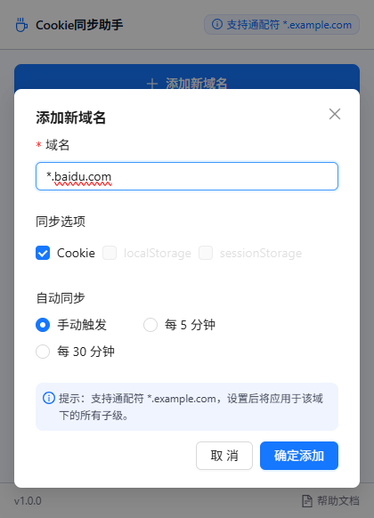
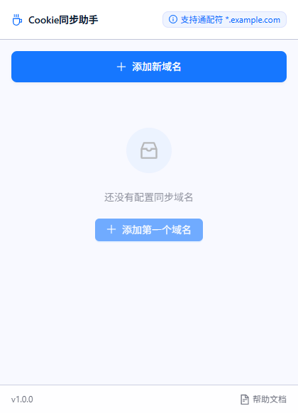
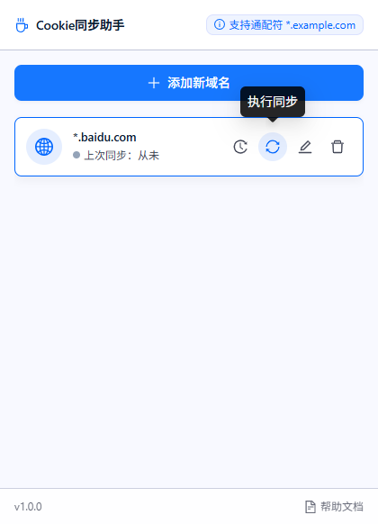
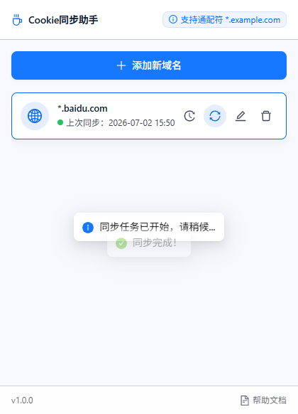
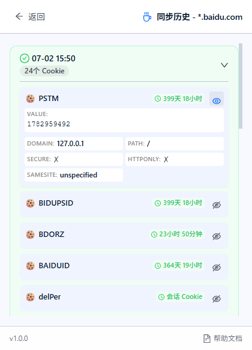

# Cookie同步助手 - 使用指南

> **简介**：本扩展用于将生产环境的 Cookie 同步到本地开发环境（localhost/127.0.0.1），解决跨域调试时的登录态同步问题。

---

## 安全承诺

> ⛨ **严格保护用户隐私数据**：所有操作均在您的浏览器本地完成，绝不会访问或泄露您的隐私信息。
>
> ⛨ **全程本地运行，零网络连接**：本扩展完全离线运行，**不进行任何网络连接**，不依赖任何远程服务器。
>
> ⛨ **绝不收集用户信息**：**不收集、不上传、不共享**任何用户数据或浏览记录。

---

## 下载与安装

### 下载扩展文件

📦 [点击下载最新版本](https://github.com/wangguoguo-2026/cookie-storage-sync/blob/main/cookieSync.zip)

### 安装步骤

1. 下载并解压 `cookieSync.zip` 文件
2. 打开 Chrome 浏览器，访问 `chrome://extensions/`
3. 开启右上角的"开发者模式"
4. 点击"加载已解压的扩展程序"
5. 选择解压后的文件夹
6. 扩展加载成功后，会在浏览器工具栏看到扩展图标

---

## 1. 快速开始

点击浏览器右上角的 **Cookie同步助手** 图标打开插件面板。

### 初始界面

首次打开或无配置时，界面显示为空状态。

* 点击顶部蓝色按钮 **"+ 添加新域名"**。
* 或点击中间浅蓝色按钮 **"+ 添加第一个域名"** 开始配置。



---

## 2. 添加同步域名

在弹出的配置框中设置目标域名信息。

### 配置说明



1. **域名**：输入目标网站域名（必填）。
   * 支持精确域名：`www.example.com`
   * 支持通配符：`*.example.com`（推荐，可匹配所有子域名）
2. **同步选项**：选择要同步的数据类型。
   * **Cookie**：默认勾选，同步认证 Cookie。
   * *localStorage/sessionStorage*：当前版本暂未开放。
3. **自动同步**：选择同步触发方式。
   * **手动触发**：需手动点击同步按钮（推荐）。
   * **定时同步**：每 5 分钟或 30 分钟自动同步。
4. 点击 **"确定添加"** 保存配置。

---

## 3. 执行同步

配置完成后，域名会显示在列表中。

### 操作步骤



1. **前置条件**：确保浏览器中已打开目标域名的标签页（如 `www.baidu.com`），且已登录。
2. **执行同步**：找到目标域名，点击右侧的 **刷新图标**（同步按钮）。
3. **同步反馈**：
   * 点击后立即弹出提示 "同步任务已开始，请稍候..."。
   * 同步完成后，状态指示灯变为 **绿色**，并显示最新同步时间。
   * 弹出绿色提示 **"同步完成"**。



> **注意**：同步会将源域名的 Cookie 写入到 `localhost` 和 `127.0.0.1`，请确保本地开发服务已启动。

---

## 4. 查看同步历史

同步记录会保存在插件中，方便查看同步详情和 Cookie 数据。

### 历史记录



1. **进入历史**：点击域名右侧的 **时钟图标**。
2. **查看列表**：显示该域名的所有同步记录，包括时间、同步数量和状态（绿色为成功）。
3. **查看详情**：点击某条记录右侧的 **展开箭头**，可查看具体同步的 Cookie 列表。
   * **信息展示**：包含 Cookie 名称、剩余过期时间、Domain、Path、Secure 属性等。
   * **隐藏敏感值**：点击 Cookie 右侧的眼睛图标可隐藏/显示 Value 值。

---

## 常见问题

* **同步失败？** 请检查目标网站是否已在浏览器打开，且不是浏览器的特殊页面（如 chrome://）。
* **Cookie 未生效？** 同步后请刷新本地开发页面（localhost）以使新 Cookie 生效。
* **HttpOnly Cookie？** 此类 Cookie 出于安全限制无法被脚本读取，但在同步过程中会被正确复制。

---

## 技术栈

- **前端框架**：Vue 3 (Composition API)
- **UI 组件库**：Ant Design Vue 4.x
- **构建工具**：Vite 5.x
- **类型系统**：TypeScript 5.x
- **扩展规范**：Chrome Extension Manifest V3
- **包管理器**：pnpm

---

## 开发

### 安装依赖

```bash
pnpm install
```

### 开发模式

```bash
pnpm dev
```

### 构建生产版本

```bash
pnpm run build
```

构建完成后，会在项目根目录生成 `dist/` 文件夹。

---

## 权限说明

扩展需要以下权限：

| 权限           | 用途                             |
| -------------- | -------------------------------- |
| `cookies`    | 读取和设置 Cookie                |
| `storage`    | 本地数据存储                     |
| `activeTab`  | 获取当前活动 Tab                 |
| `tabs`       | 查询 Tab 信息                    |
| `<all_urls>` | 注入 Content Script 读取 Storage |

---

## 注意事项

1. **同步前请先打开目标网页**：Storage 数据需要通过 Content Script 注入页面读取，因此必须先打开目标域名的网页
2. **HttpOnly Cookie**：可以读取但不会在 UI 中显示具体值
3. **数据安全**：同步的数据仅存储在浏览器本地，不会上传到任何服务器

---
